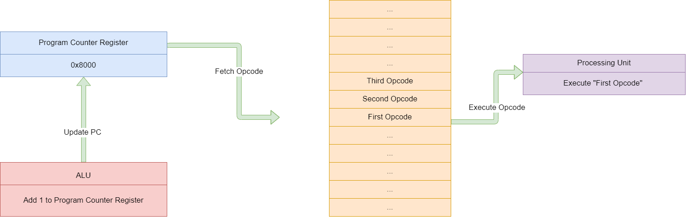
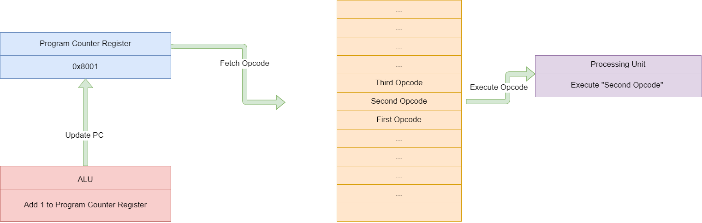

# So, how does it execute programs? 

## What does a program consist of at the hardware level?

A program consists of a list of machine instructions. A machine instruction is made up of an opcode and extra operand address resolving bytes (could have 0,1 or 2 - depending on the opcode). There are several variants of instructions which the 6502 offers us. 

+ Transfer Instructions : Load and store memory, transfer contents between registers
+ Stack Instructions : Push / Pop data from stack from / to registers. 
+ Arithmetic & Logical Instructions : Increment/Decrement registers, AND/OR/XOR operations, bit-shift operations and Process Status Register (P) operations, comparison operations and more.  
+ Branching Instructions : Manipulate PC to execute loops, if-else conditions, interrupt request routines (IRQ), jump to function routines and more. 

For most of the 6502 instructions, the opcode requires an operand to execute the instruction on. For example, the AND instruction will perform a bitwise AND between the accumulator register and some data which is present in the same memory stack somewhere. To retrieve this memory value, the AND opcode requires some extra byte(s) of data to resolve the address of the operand and pass to ALU for execution. Take a look at all the operand addressing modes [here](http://www.emulator101.com/6502-addressing-modes.html#:~:text=The%206502%20has%20the%20ability,to%20the%20address%20being%20accessed.&text=This%20addressing%20mode%20makes%20the,register%20to%20an%20absolute%20address.).

Opcodes may or may not require an operand. For example : 

+ CLC (0x18) - The Clear Carry Bit instruction does not require any operands, as it is implied that it should clear the carry bit in the process status register. Therefore, this machine instruction is only 1 byte long.

+ AND, ZeroPage Addressing (0x25 byte1) - AND memory with accumulator and store result back in accumulator. For zeropage addressing, the instruction requires 1 extra byte to resolve operand address. 

+ AND, Absolute Addressing (0x2D byte1 byte2) - Again, AND memory with accumulator and store result back in accumulator. Except this time, for absolute addressing mode, opcode requires 2 extra bytes to resolve operand address. Therefore, this instruction requires 3 bytes of memory.

## Program Execution 

The hardware fetches and executes from the address the PC points to. The PC is then updated to point to the next instruction. An example execution of single byte opcode is as shown below. 

 \

In the case of multiple-byte non-branching opcodes, the PC gets updated to PC + n, where n is the length of the instruction in bytes.

In the case of a branching instruction, the PC is updated with the new address to branch to, from the branch instruction operands. Intelligently controlling the PC branching can help us create loops, if-else statements, function routines and IRQ handling routines. 
