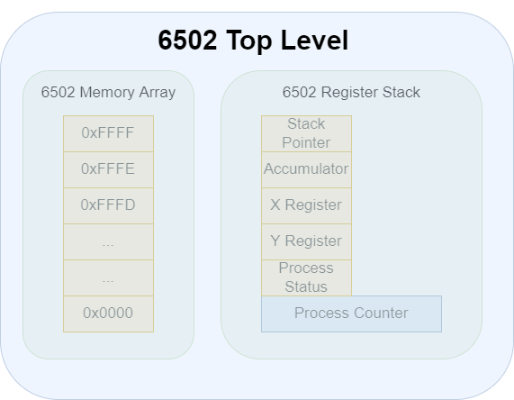

# 6502 at the Top Level

The 6502 is a fairly simple processor. It consists of a bunch of IO pins, a handful of internal state registers and 64kB of memory. Since we are building a software implementation of it, we will not be looking at the pinout diagram.

## Regs and Mem




The 6502 has the following registers:
- Stack Pointer (SP) : 8 bits 
- Accumulator (A) : 8 bits 
- Register X (X) : 8 bits
- Register Y (Y) : 8 bits
- Process Status Register (P) : 8 bits
- Process Counter (PC) : 16 bits

The memory address ranges from 0x0000 to 0xFFFF. Each memory location can accomodate a single byte of data. 

In our program, we define a struct CPU with these components as shown below. This structure will be continuosly updated everytime the CPU state changes on execution of an instruction.

<div class="code-example" markdown="1">

```cpp
/* Definition in src/cpu.h */

#define MEM_SIZE 0xFFFF; // Memory Size

/* CPU definition */
struct cpu
{
    uint16_t PC; 
    uint8_t SP;
    uint8_t A;
    uint8_t X;
    uint8_t Y;
    uint8_t P;
    uint8_t memory[MEM_SIZE];

} CPU;
```
</div>

In the following chapters, we will see how to initialize and modify CPU states to execute a given program.

